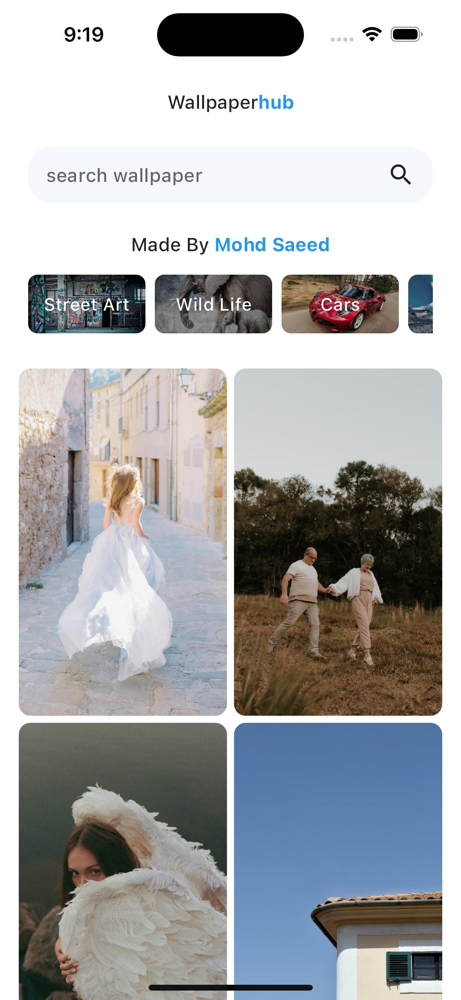
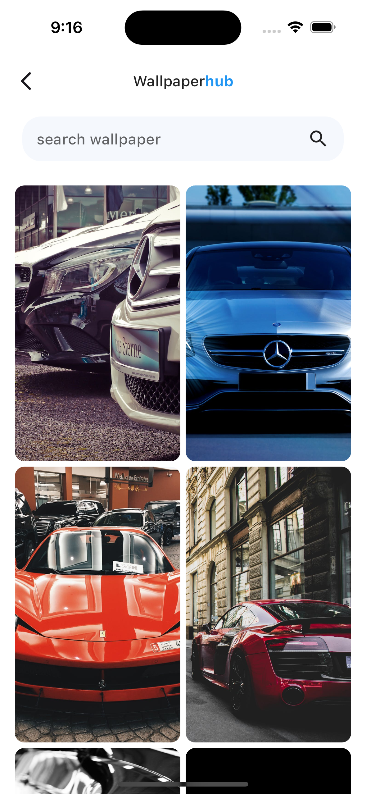
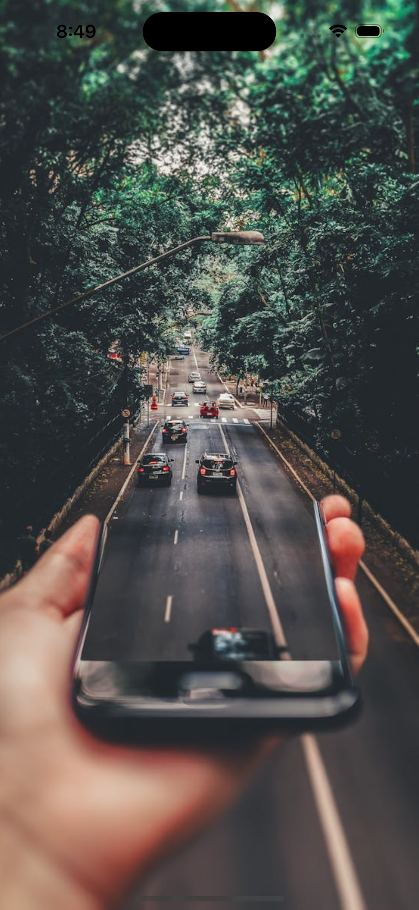

# WallpaperHub

WallpaperHub is a Flutter application that allows users to browse, search beautiful wallpapers.
The app fetches wallpapers from the Pexels API and categorizes them into various themes for easy navigation. 
It is designed to be responsive and works on both Android and iOS devices. 
This project was created for learning purposes.

## Features

- Browse trending wallpapers
- Search wallpapers by category or keyword
- View wallpapers by category
- Responsive UI for both Android and iOS devices

## Screenshots

<div style="display: flex;">
  
  
  
</div>

## Installation

To run this project, ensure you have Flutter installed on your local machine. If not, follow the instructions [here](https://flutter.dev/docs/get-started/install).

1. Clone the repository:

   ```sh
   git clone https://github.com/saeed-mohammad/flutter_wallpaperhub.git 
   cd flutter_wallpaperhub
   open the project on you IDE